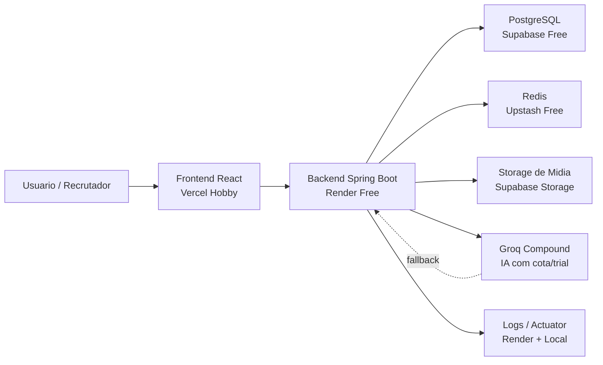
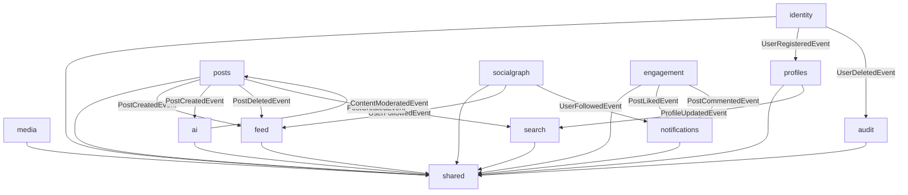
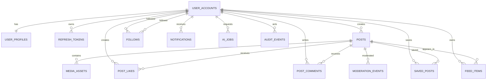
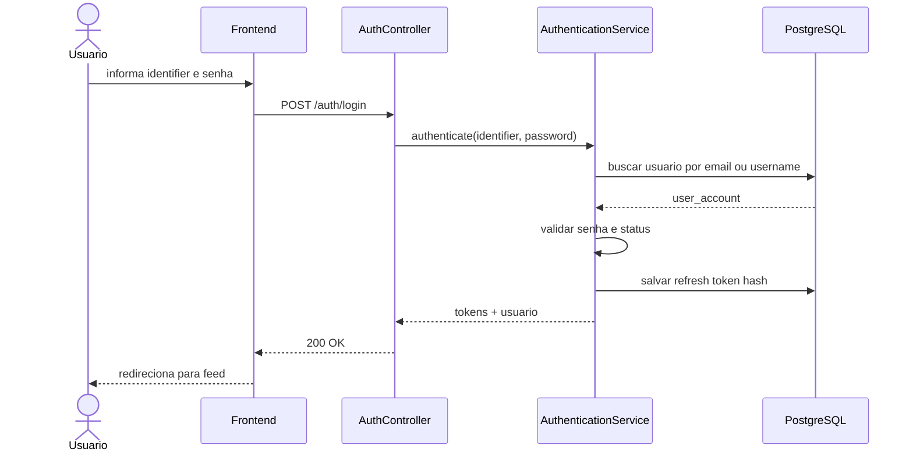
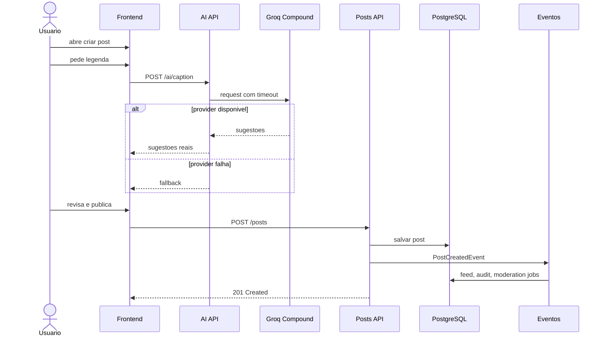
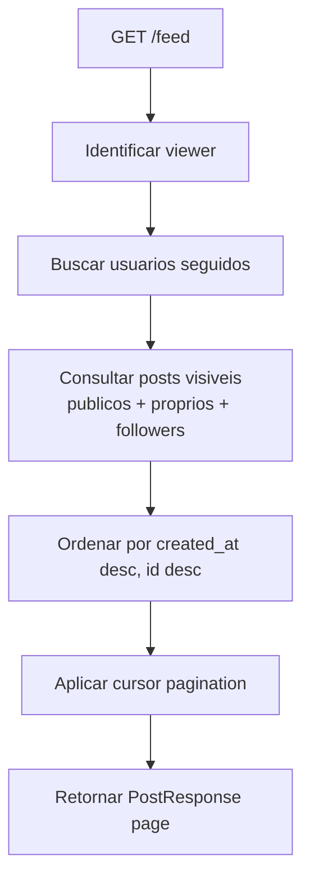
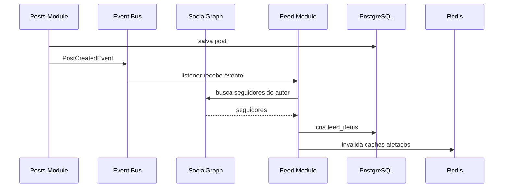
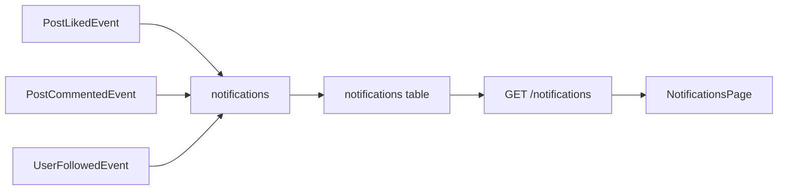
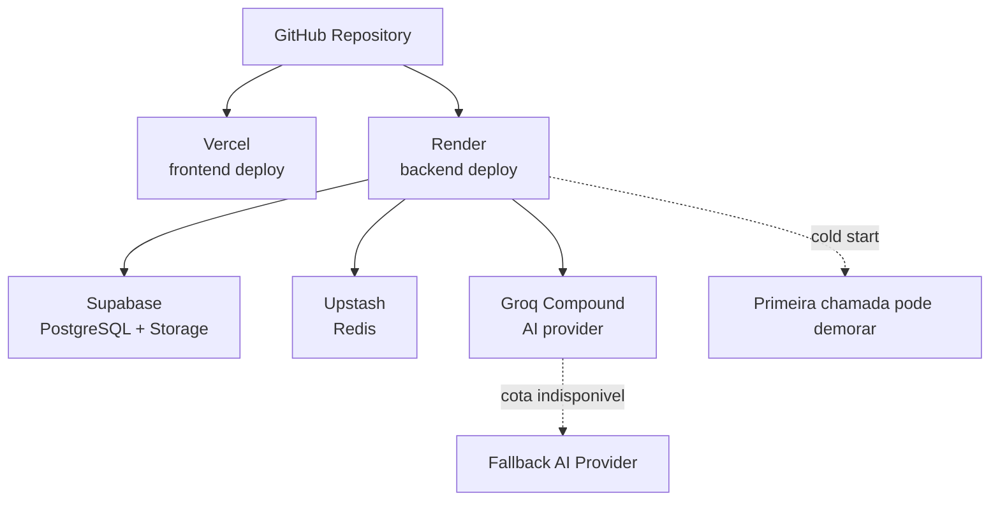
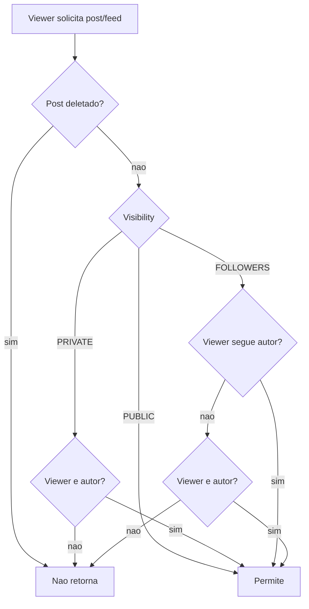

# Diagramas

Este arquivo contem diagramas Mermaid para usar no GitHub, README, documentacao tecnica e apresentacoes.

## Arquitetura Geral

## Spring Modulith

## Entidades Principais

## Fluxo De Login

## Criacao De Post Com IA

## Feed Direto MVP

## Feed Materializado Portfolio

## Notificacoes

## Deploy Custo Zero

## Fluxo De Privacidade De Post

