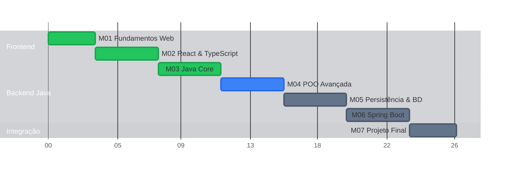

# 🚀 3035TEACH - Portfólio Fullstack Developer


<div align="center">

[](https://opensource.org/licenses/MIT)


</div>

## 📖 Sobre o Projeto

Este repositório documenta minha jornada e evolução técnica durante o programa de formação **Fullstack Developer** da **3035TECH**. Aqui estão reunidos **7 módulos** de aprendizado intensivo, totalizando mais de **600 horas** de prática, indo desde os fundamentos da web até a construção de arquiteturas complexas de microsserviços.

O foco principal é o desenvolvimento de soluções robustas, escaláveis e seguras utilizando a stack **Java (Spring)** no Backend e **React (TypeScript)** no Frontend, sempre seguindo boas práticas de engenharia de software (SOLID, Clean Code).

---

## ✨ Destaques Técnicos

O diferencial deste portfólio está na aplicação prática de conceitos avançados:

- **🔐 Segurança Avançada**: Implementação completa de autenticação e autorização via **JWT (Stateless)** com Spring Security.
- **🏗️ Arquitetura Limpa**: Backend estruturado em **Camadas (Layered Architecture)**, respeitando princípios SOLID para desacoplamento e testabilidade.
- **⚡ Frontend Moderno**: SPA reativa com **React Hooks**, **Context API** e **TypeScript** para type-safety.
- **🗄️ Persistência Eficiente**: Uso de **Spring Data JPA** e **Hibernate** para modelagem complexa de dados e otimização de queries, com suporte a migrações de banco.
- **🛠️ Design Patterns**: Aplicação real de padrões como **Strategy**, **Factory** e **Dependency Injection**.

---

## 🛠️ Tech Stack

### Backend
- **Core**: Java 17+, Spring Boot 3+
- **Data**: Spring Data JPA, PostgreSQL/MySQL, H2 Database (Testes)
- **Security**: Spring Security, JWT (JJWT)
- **Tools**: Maven/Gradle, Swagger (OpenAPI), Docker

### Frontend
- **Core**: React.js 18, TypeScript
- **Styling**: CSS Modules / Styled Components / Tailwind (se aplicável)
- **State**: Context API / Redux (se aplicável)
- **Build**: Vite / CRA

---

---

## 🗺️ Jornada de Aprendizado

```mermaid
%%{init: {
  "theme": "dark",
  "themeVariables": {
    "primaryTextColor": "#ffffff",
    "primaryBorderColor": "#ffffff"
  }
}}%%
flowchart LR

    %% ===== CLASSES =====
    classDef root fill:#0f172a,color:#ffffff,stroke:#c084fc,stroke-width:3px;

    classDef frontend fill:#2dd4bf,color:#000000,stroke:#14b8a6,stroke-width:2px;
    classDef backend fill:#fbbf24,color:#000000,stroke:#f59e0b,stroke-width:2px;
    classDef advanced fill:#c084fc,color:#000000,stroke:#a855f7,stroke-width:2px;
    classDef consolidacao fill:#4ade80,color:#000000,stroke:#22c55e,stroke-width:2px;

    %% ===== ROOT =====
    A["🚀 3035TEACH Fullstack"]:::root

    %% ===== FRONTEND =====
    subgraph F["🎨 Frontend"]
        F1["M01: Fundamentos Web"]:::frontend
        F2["HTML5, CSS3, JS"]:::frontend
        F3["M02: React & TS"]:::frontend
        F4["Hooks, Context, Vite"]:::frontend
    end

    %% ===== BACKEND JAVA =====
    subgraph BJ["☕ Backend Java"]
        B1["M03: Lógica"]:::backend
        B2["Sintaxe, Coleções"]:::backend
        B3["M04: POO"]:::backend
        B4["Classes, SOLID"]:::backend
    end

    %% ===== BACKEND AVANÇADO =====
    subgraph BA["⚙️ Backend Avançado"]
        A1["M05: Persistência"]:::advanced
        A2["SQL, JPA, Hibernate"]:::advanced
        A3["M06: Spring Boot"]:::advanced
        A4["API REST, Security"]:::advanced
    end

    %% ===== CONSOLIDAÇÃO =====
    subgraph C["🏆 Consolidação"]
        C1["M07: Projeto Final"]:::consolidacao
        C2["Arquitetura Fullstack"]:::consolidacao
    end

    %% ===== FLOW =====
    A --> F --> BJ --> BA --> C

    F1 --> F2
    F3 --> F4
    B1 --> B2
    B3 --> B4
    A1 --> A2
    A3 --> A4
    C1 --> C2
```



### 📅 Cronograma




## 📂 Estrutura dos Módulos

| Status | Módulo | Foco de Aprendizado | Projeto Prático |
| :---: | :--- | :--- | :--- |
| ⏳ | [**M07 - Desafio Final**](./M07-Desafio-Final) | **Arquitetura & Integração Final** | *Microserviço de Task Management Fullstack* |
| ⏳ | [**M06 - Spring Boot**](./M06-Backend-IV-Spring-Boot) | **Spring Boot & Security** | API RESTful com Autenticação JWT |
| ⏳ | [**M05 - Banco de Dados**](./M05-Backend-III-Java-BD) | **Persistência (JPA/Hibernate)** | DAO Genérico e Modelagem de Dados |
| 🟡 | [**M04 - POO Java**](./04-java-avancado) | **POO Avançada (Java)** | Sistema com Injeção de Dependência Manual |
| 🟢 | [**M03 - Lógica Java**](./03-backend-java) | **Lógica & Algoritmos** | Estruturas de Dados em Java |
| 🟢 | [**M02 - React**](./02-frontend-react) | **React & TypeScript** | Dashboard Interativo com Consumo de API |
| 🟢 | [**M01 - Web Basics**](./01-fundamentos-web) | **Fundamentos Web** | Landing Pages Responsivas |


---

## 📚 Documentação & Wiki

A documentação completa do projeto, incluindo guias de estudo, padrões de código e detalhes arquiteturais, está disponível na pasta [`/wiki`](./wiki).

Destaques da Wiki:
- [🏁 Guia de Início Rápido](./wiki/Quick-Start-Guide.md)
- [🗺️ Roadmap de Estudos](./wiki/Study-Roadmap.md)
- [🏗️ Arquitetura do Projeto](./wiki/Project-Architecture.md)
- [📏 Padrões de Código](./wiki/Coding-Standards.md)
- [❓ FAQ & Troubleshooting](./wiki/FAQ.md)

Acesse a [Home da Wiki](./wiki/Home.md) para navegar por todos os tópicos.

---

## 🚀 Quick Start

Para rodar os projetos localmente, siga os passos abaixo:

### Pré-requisitos
- Java 17+
- Node.js 18+
- Maven (Opcional, wrapper incluído)

### 1. Backend (Ex: M06/M07)
```bash
cd M06-Backend-IV-Spring-Boot
./mvnw spring-boot:run
# O servidor iniciará em http://localhost:8080
```

### 2. Frontend (Ex: M02)
```bash
cd M02-Frontend-II-React
npm install
npm run dev
# A aplicação estará disponível em http://localhost:5173 (ou 3000)
```

---

## 🤝 Contribuição & Contato

Sugestões e feedbacks são sempre bem-vindos!

- **Email**: [charllesgst@gmail.com](mailto:charllesgst@gmail.com)
- **LinkedIn**: [linkedin.com/in/charlles-augusto](https://linkedin.com/in/charlles-augusto)
- **Portfólio**: [charlles.dev](https://charlles.dev)

---
<div align="center">
  <sub>Desenvolvido com dedicação por <a href="https://github.com/charlles-dev">charlles-dev</a> 🚀</sub>
</div>
